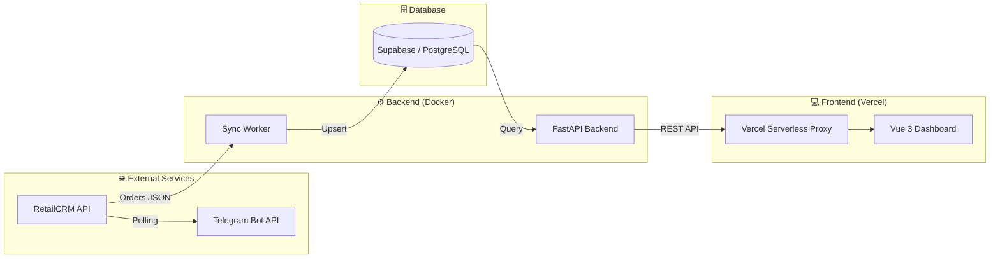

# 📊 RetailCRM Analytics Dashboard

<div align="center">

[](https://gbc-analytics-dashboard.vercel.app/)
[](https://github.com/xpl0itK3y/gbc-analytics-dashboard)


**Полнофункциональный аналитический дашборд для RetailCRM.**  
Система объединяет CRM, облачную БД и Telegram для сквозной аналитики заказов в реальном времени.

</div>

---

## 🎬 Демо

https://github.com/user-attachments/assets/c166d9e0-395c-4113-a33a-1f902b1175e4

---

## 🏗 Архитектура системы



Данные идут по чёткой однонаправленной цепочке: каждый слой изолирован и имеет единственную ответственность.

---

## ⚡ Ключевые возможности

| Функция | Описание |
|---|---|
| 🔄 **Realtime Sync** | Автоматическая синхронизация заказов из RetailCRM в Supabase |
| 📈 **Live Dashboard** | Polling каждые 15 секунд, обновление без перезагрузки страницы |
| 📊 **Аналитика** | Выручка, количество заказов, динамика по дням — Chart.js |
| 🤖 **Telegram Alert** | Уведомление при заказе свыше 50 000 ₸ в реальном времени |
| 🔒 **Безопасность** | IP бэкенда скрыт за Vercel Serverless Proxy |

---

## 🛠 Технический стек

```
Frontend   │ Vue 3 · Chart.js · Vite · Vercel Serverless Functions
Backend    │ FastAPI · Pydantic · httpx · Docker
Database   │ Supabase (PostgreSQL) · REST API
Services   │ RetailCRM API · Telegram Bot API
```

---

## 🚩 Инженерный лог: Вызовы и решения

### 1. Vercel Routing "404/500 Saga"

> **Проблема:** Ошибки 404/500 при попытке достучаться до API через Vercel. Стандартные `rewrites` работали нестабильно.

**Решение:** Отказался от rewrite-правил в пользу **прямых Serverless-хендлеров** (`frontend/api/stats.js`). Это создало надёжный "шлюз", который проксирует запросы на VPS, не раскрывая его IP.

---

### 2. Проблема "Плоского графика"

> **Проблема:** Заказы из моков загружались одной датой, превращая график в одну точку.

**Решение:** Внедрён алгоритм **"Demo Time Spreading"** — система автоматически распределяет данные по таймлайну последних 10 дней для визуальной наглядности.

---

### 3. Безопасность данных

> **Проблема:** Риск "засветить" IP-адрес сервера в скомпилированном JS-бандле.

**Решение:** Весь фронтенд работает через относительный путь `/api/*`. Реальный IP хранится только в `VITE_API_BASE_URL` на стороне Vercel — бэкенд невидим для внешних наблюдателей.

---

## 🤖 AI Workflow: Промпты и итерации

Проект написан в связке с **OpenCode CLI** — терминальным AI-ассистентом с моделью **Kimi K2.5 Thinking** (Moonshot AI).

> **Почему промпты на английском?**  
> LLM-модели обучены преимущественно на англоязычной технической документации и GitHub-коде. На английском модель точнее интерпретирует термины, генерирует более идиоматичный код и реже "галлюцинирует" детали API.

<details>
<summary><b>📋 Пошаговые промпты (развернуть)</b></summary>

#### 🟦 Шаг 1 — Проектирование
```
You are a senior full-stack engineer.
We're building a mini order dashboard step by step - wait for confirmation after each step,
ask if anything is unclear. Stack: FastAPI, Supabase, Vue 3, Vercel, Telegram bot in Python.
Never hardcode credentials - use RETAILCRM_API_KEY, SUPABASE_URL, SUPABASE_KEY, BOT_TOKEN,
CHAT_ID as placeholders.
Generate a project file tree with inline comments. Structure: backend/app/ with main.py
and subfolders services, routes, models, utils - frontend/ for Vue, scripts/ with
upload_orders.py, plus .env.example and README.md at root.
Note which files get created in later steps.
```

#### 🟦 Шаг 2 — Загрузка данных в CRM
```
Write scripts/upload_orders.py. Read mock_orders.json, POST each order to RetailCRM
/api/v5/orders/create. On failure — log and continue, don't abort. Print a final summary.
Use requests, clean functions, docstrings, creds from .env.
```

#### 🟦 Шаг 3 — Синхронизация RetailCRM → Supabase
```
Write backend/app/services/sync_service.py. Fetch orders from RetailCRM paginated,
map to Supabase schema: id, number, first_name, last_name, phone, status, total, city,
utm_source, created_at. Upsert via REST using number as dedup key. Log inserted vs skipped.
```

#### 🟦 Шаг 4 — FastAPI Backend
```
Create main.py (entry point + CORS), routes/orders.py, models/order.py.
Two endpoints: GET /orders с фильтрами status, city, limit — GET /stats возвращает
total_orders, total_revenue, orders_per_day. Async httpx, Pydantic validation, proper error codes.
```

#### 🟦 Шаг 5 — Фронтенд (Vue 3)
```
Vue 3 app with global polling every 15s in App.vue.
Components: OrdersTable.vue paginated, status badges, StatsCards.vue orders + revenue,
RevenueChart.vue Chart.js, orders per day. Native fetch, base URL from import.meta.env,
no CSS frameworks, loading and error states in each component.
```

#### 🟦 Шаг 6 — Telegram Бот
```
Write scripts/telegram_bot.py. Poll RetailCRM every 30s. If order.total > 50000 and not
yet sent — notify via Telegram: "#{number} / {total} ₸ / {name} / {city}".
Track sent orders in seen_orders.json. requests only, try/except around the loop,
log each notification.
```

#### 🟦 Шаг 7 — Деплой
```
Deployment checklist for three parts. Frontend: vercel.json с /api/* proxy, env vars,
build config. Backend: Railway/Render free tier, Procfile, env vars, public URL.
Bot: systemd или nohup на VPS, auto-restart on crash.
```

</details>

---

## 🚀 Установка и запуск

### Требования
- Docker & Docker Compose
- Python 3.11+
- Node.js 18+

### Быстрый старт

```bash
# 1. Клонирование
git clone https://github.com/xpl0itK3y/gbc-analytics-dashboard.git
cd gbc-analytics-dashboard

# 2. Конфигурация
cp .env.example .env
# Заполните переменные в .env

# 3. Запуск через Docker
docker compose up -d --build

# 4. Демо-поток (опционально)
python3 scripts/demo_bot.py
```

### Переменные окружения

```env
RETAILCRM_API_KEY=your_key
RETAILCRM_URL=https://your-shop.retailcrm.ru

SUPABASE_URL=https://xxx.supabase.co
SUPABASE_KEY=your_anon_key

BOT_TOKEN=your_telegram_bot_token
CHAT_ID=your_chat_id
```

---
